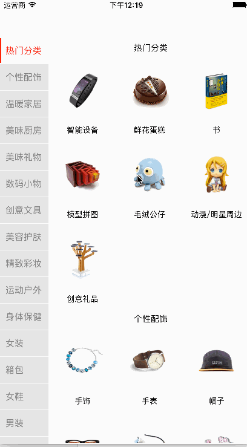

#类似礼物说的二级联动效果
###已经封装成一个类`ZNBTabCollectionView`,使用效果跟`UITableView`相似
> `ZNBTabCollectionView`继承自UIView;使用时直接alloc, initWithFrame创建,设置代理,设置数据源,遵守`ZNBTabCollectionViewDataSource`,`ZNBTabCollectionViewDelegate`协议,实现方法即可

#### 具体的使用可以参考源码

#### 效果如下

